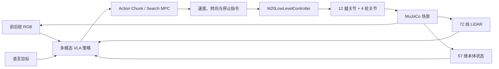

# M20 Pro 多模态 VLA 导航与具身控制

<p align="center">
  <strong>RGB + LiDAR + 本体状态 + 语言指令 → Action Chunk → 轮腿机器人闭环执行</strong>
</p>

<p align="center">
  
  
  
  
  
</p>

<p align="center">
  
</p>

面向 DEEP Robotics M20 Pro 轮腿机器人，构建语言条件 ObjectNav（目标物体导航）与具身控制系统。高层策略融合前后视 RGB、72 线 LiDAR、本体状态和自然语言，输出连续动作块；低层控制器统一负责轮腿动作映射、限幅、制动和姿态稳定。

> 本仓库对应项目的 **VLA / MuJoCo 研究部分**；真实机器人 ROS 2 导航、跨楼层巡检和 Web 监理系统见 [m20pro-supervision-system](https://github.com/ghw1048040694/m20pro-supervision-system)。

## 项目亮点

| 模块 | 完成内容 |
| --- | --- |
| 多模态感知 | 前后视 RGB、72 线 LiDAR、57 维本体状态和 UTF-8 语言指令 |
| 动作建模 | 一次预测 `8 × 16` 连续动作块，支持缓存、分段执行与滚动重规划 |
| 轮腿控制 | 12 个腿关节 + 4 个轮关节，统一关节顺序、镜像符号、动作缩放与 PD 参数 |
| 闭环导航 | 目标搜索、接近、驻停、障碍感知与过期动作拦截 |
| 风险评估 | World Model / Search MPC 接口，用于候选动作块的短时安全评分 |

## 系统架构



## 核心成果

- 完成 M20 Pro URDF/USD 与 MuJoCo 控制接口适配，修正关节顺序、后腿镜像符号、动作缩放及 PD 参数；原生 ONNX 策略连续运行 500 步，前进 `14.72 m` 且无异常终止。
- 同步采集 RGB、LiDAR、本体状态、语言与 16 维动作数据，使用 9 条有效轨迹构建 `1206` 个训练窗口，最佳验证损失达到 `1.03 × 10⁻⁴`。
- 建立动作块缓存、滚动重规划和安全执行链路，在固定目标场景中实现语言目标驱动的搜索、接近与驻停，最小目标距离 `0.111 m`。
- 将高层策略与底层执行解耦，所有策略统一输出 `[forward, lateral, yaw, stop]`，避免 VLA 直接写入关节指令并绕过安全约束。

## 代码导航

| 路径 | 说明 |
| --- | --- |
| `src/m20pro_vla/sim/` | MuJoCo 场景、RGB/LiDAR/本体观测与视频工具 |
| `src/m20pro_vla/policies/` | RGB、LiDAR、语言条件策略 |
| `src/m20pro_vla/low_level/` | 轮腿低层控制、制动、安全门与回归测试 |
| `src/m20pro_vla/planning/` | Action Chunk 搜索与 MPC 规划 |
| `src/m20pro_vla/world_model/` | 轨迹和候选动作块风险评分 |
| `configs/` | 观测、动作、低层控制与评估合同 |

## 快速开始

```bash
python3 -m pip install -e . --no-deps

m20pro-vla doctor
m20pro-vla prepare
m20pro-vla smoke
m20pro-vla low-level-gate
m20pro-vla report
```

VLA 可选依赖：

```bash
python3 -m pip install -e '.[vla]'
m20pro-vla collect --help
m20pro-vla train --help
m20pro-vla eval --help
m20pro-vla play --help
```

## 接口合同

| 配置 | 作用 |
| --- | --- |
| `configs/m20pro_mujoco_vla_contract_v1.yaml` | 多模态输入、动作表示与数据要求 |
| `configs/m20pro_low_level_v1.yaml` | 低层控制输出、反馈与安全门 |
| `configs/m20pro_vla_eval_v1.yaml` | 可见目标、隐藏目标、泛化和障碍评估 |

公开仓库未包含现场地图、真实机器人驱动、数据集、模型权重及私有资产；这些资源通过本地配置注入，不影响阅读核心架构和接口实现。

## 关键词

`Embodied AI` · `VLA` · `ObjectNav` · `Action Chunk` · `World Model` · `MPC` · `MuJoCo` · `LiDAR` · `Legged-Wheeled Robot`
