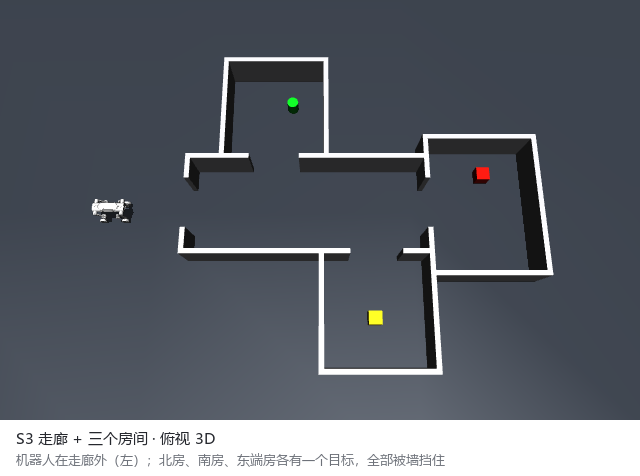
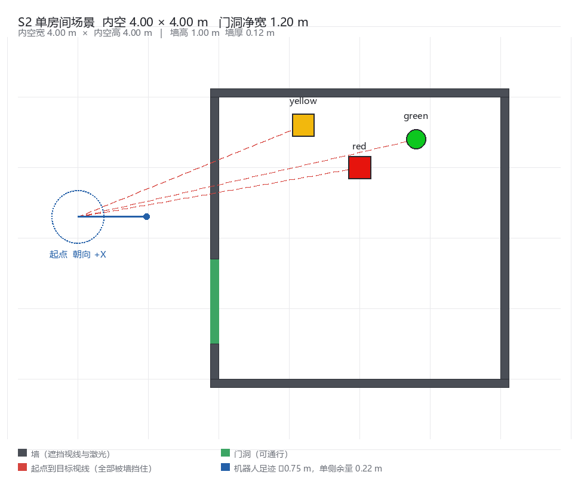
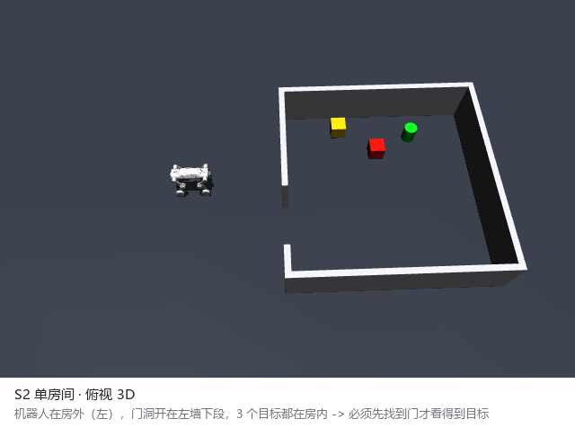
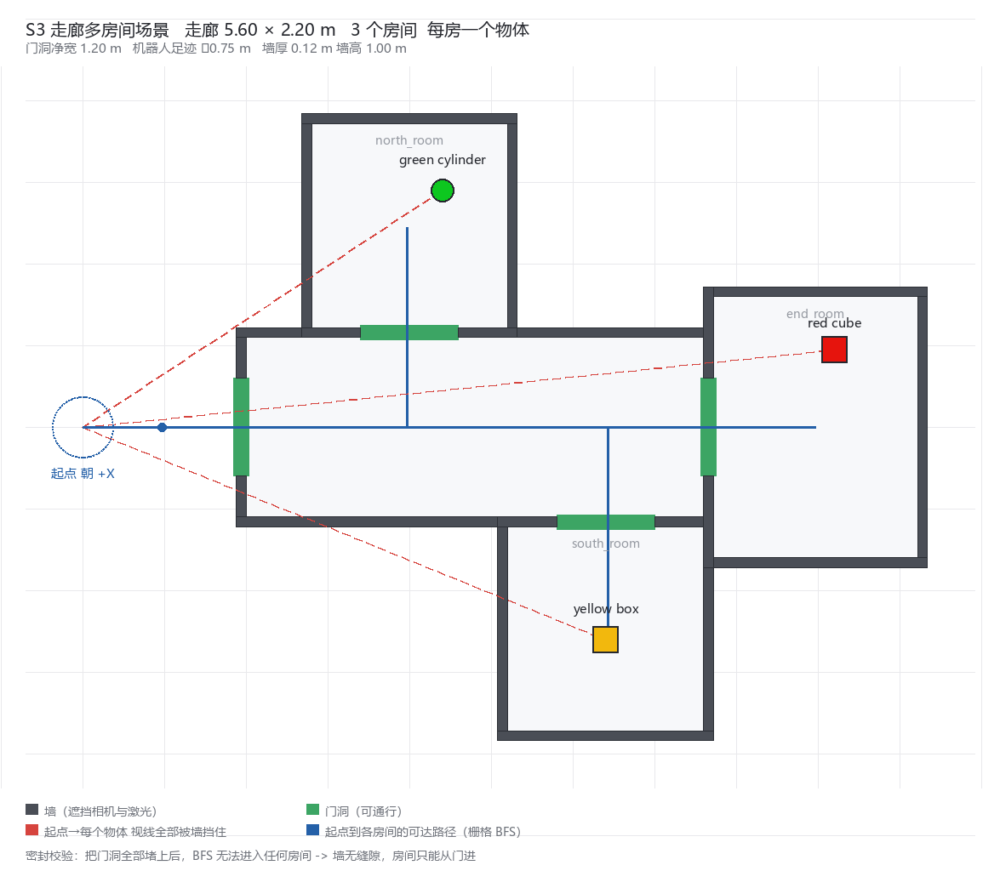
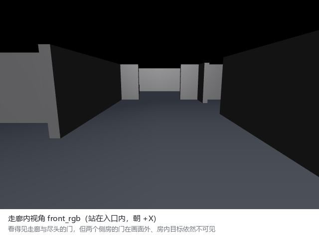
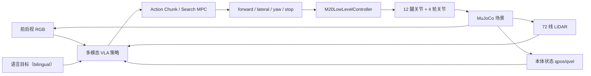

# M20 Pro 多模态 VLA 导航与具身控制

<p align="center">
  <strong>RGB + LiDAR + 本体状态 + 语言指令 &rarr; Action Chunk &rarr; 轮腿机器人闭环执行</strong>
</p>

<p align="center">
  
  
  
  
  
  
</p>

<p align="center">
  
  <br>
  <em>S3 走廊多房间场景：机器人在走廊外，北 / 南 / 东三个房间各有一个目标，全部被墙遮挡 —— 这是一次搜索任务，而不是指向任务。</em>
</p>

面向 DEEP Robotics M20 Pro 轮腿机器人，构建语言条件 ObjectNav（目标物体导航）与具身控制系统。高层策略融合前后视 RGB、72 线 LiDAR、本体状态和自然语言，输出连续动作块；低层控制器统一负责轮腿动作映射、限幅、制动和姿态稳定。

> **仓库定位**：本仓库只包含 VLA / MuJoCo 研究部分；真实机器人 ROS 2 导航、跨楼层巡检和 Web 监理系统见 [m20pro-supervision-system](https://github.com/ghw1048040694/m20pro-supervision-system)。本仓库不控制真机、不安装自启动、不访问现场服务。
>
> **项目状态**：研究与开发进行中 —— 本仓库反映当前代码快照与工作方法，各项指标仍在迭代，不代表最终结果。

## 项目亮点

| 模块 | 完成内容 |
| --- | --- |
| 多模态感知 | 前后视 RGB（策略分辨率 `160 x 96`）、72 线 LiDAR、本体状态和 UTF-8 双语语言指令 |
| 动作建模 | 高层预测连续动作块 `[forward, lateral, yaw, stop]`，支持缓存、分段执行与滚动重规划 |
| 轮腿控制 | 12 个腿关节 + 4 个轮关节，统一关节顺序、镜像符号、动作缩放与 PD 参数 |
| 结构化场景 | S2 单房间隐藏目标、S3 走廊多房间两套程序化场景，渲染前强制校验遮挡与可达性 |
| 闭环导航 | 目标搜索、接近、驻停锁存、障碍感知、安全盾与过期动作拦截 |
| 数据流水线 | 采集 &rarr; 质量门禁 &rarr; 筛选 &rarr; LeRobotDataset &rarr; SmolVLA 微调 &rarr; 闭环验收 |

## 仿真场景

两套场景均由代码程序化生成、可复现、可校验。关键约束（遮挡成立、房间密封、门洞净宽、机器人足迹余量）在渲染前先做断言，不通过则直接拒绝生成 —— 场景本身也是被验收的对象。

### S2 · 单房间隐藏目标

机器人从房外出发，门洞开在左墙下段，三个目标全部在房内。起点处相机画面被墙面占满，**必须先找到门才可能看到目标**。

<p align="center">
  
  
</p>

### S3 · 走廊多房间（OOD 泛化评测集）

走廊 `5.60 x 2.20 m`，北 / 南 / 东三个房间各放置一个目标，门洞净宽 `1.20 m`，机器人足迹直径 `0.75 m`。把门洞全部封上后 BFS 无法进入任何房间，证明**房间只能从门进**，墙无缝隙。

<p align="center">
  
  
</p>

走廊内视角：机器人站进门内朝 `+X`，能看到走廊与尽头的门，但两个侧房的门在画面之外，房内目标依然不可见。

<p align="center">
  
</p>

## 系统架构



## 观测与动作合同

策略输入被严格限制为 **front_rgb / rear_rgb / planar_lidar_72 / qpos_qvel / language_instruction**；目标世界坐标、仿真物体位姿、几何 ID、语义掩码一律禁止进入策略。所有策略统一输出 `[forward, lateral, yaw, stop]` 机身命令，由低层控制器负责关节映射与安全约束，**禁止 VLA 直接写入关节指令**。

## 工程进展

以下为当前快照已完成的工作与工作方法。各项指标仍在迭代，本页不对效果下结论。

- 完成 M20 Pro 轮腿低层控制器工程化，统一关节顺序、后腿镜像符号、动作缩放与 PD 参数，并接入原生 ONNX 策略做连续步态验证。
- 建立 S2 / S3 程序化结构化场景与遮挡校验，采集 `41` 局通过质量门禁的专家搜索轨迹（步态门限：roll/pitch `<= 8 deg`、角速度 RMS `<= 0.28 rad/s`），转换出 `36937` 帧 LeRobotDataset。
- 基于 `lerobot/smolvla_base` 完成 `13500` 步（约 `4.4` epoch）高层策略微调，打通「采集 &rarr; 质量门禁 &rarr; 筛选 &rarr; 训练 &rarr; 闭环评测」全链路。
- 闭环验收判据、安全盾与碰撞容忍口径全部参数化，同一批评测结果可按不同严格度复算，便于横向比较。
- 当前正在推进：低层步态平稳性、跨场景泛化能力。

## 代码导航

| 路径 | 说明 |
| --- | --- |
| `src/m20pro_vla/sim/` | MuJoCo 场景、S2 房间 / S3 走廊生成器、RGB/LiDAR/本体观测与视频工具 |
| `src/m20pro_vla/policies/` | RGB / LiDAR / 语言条件策略 |
| `src/m20pro_vla/low_level/` | 轮腿低层控制、制动、安全盾与回归测试 |
| `src/m20pro_vla/planning/` | 全局栅格规划、Action Chunk 搜索与 MPC |
| `src/m20pro_vla/data/` | 采集分布、可见性、筛选、失败恢复与 LeRobot 适配 |
| `src/m20pro_vla/training/` | SmolVLA 微调与训练标准门禁 |
| `src/m20pro_vla/eval/` | 闭环验收判据（到达 / 驻停 / 姿态 / 碰撞） |
| `src/m20pro_vla/world_model/` | 轨迹和候选动作块风险评分 |
| `configs/` | 观测、动作、低层控制与评估合同 |

## 快速开始

```bash
python3 -m pip install -e . --no-deps

m20pro-vla doctor
m20pro-vla prepare
m20pro-vla smoke
m20pro-vla low-level-gate
m20pro-vla report
```

### 单配置实验入口

每个实验只新增或复制一个 JSON 配置，不新增 Python / Shell 脚本。全流程由同一份
`configs/experiment.json` 驱动，覆盖路径、采集、数据门槛、训练超参、评估参数与晋级标准：

```bash
python3 -m pip install -e '.[vla]'

m20pro-vla experiment --config configs/experiment.json --stage plan
m20pro-vla experiment --config configs/experiment.json --stage collect
m20pro-vla experiment --config configs/experiment.json --stage curate
m20pro-vla experiment --config configs/experiment.json --stage convert
m20pro-vla experiment --config configs/experiment.json --stage train-smolvla
m20pro-vla experiment --config configs/experiment.json --stage smolvla-eval
m20pro-vla experiment --config configs/experiment.json --stage gate
```

### 场景预览

单次 EGL 渲染，只产出图片与 JSON 报告，不训练、不写入任何实验产物：

```bash
MUJOCO_GL=egl python scripts/mujoco/preview_m20_room.py
MUJOCO_GL=egl python scripts/mujoco/preview_m20_corridor.py
```

## 接口合同

| 配置 | 作用 |
| --- | --- |
| `configs/experiment.json` | 单配置实验入口：路径、采集、数据门槛、训练超参、评估参数与晋级标准 |
| `configs/m20pro_mujoco_vla_contract_v1.yaml` | 多模态输入、动作表示与数据要求 |
| `configs/m20pro_low_level_v1.yaml` | 低层控制输出、反馈与安全门 |
| `configs/m20pro_real_vla_deploy_contract_v1.yaml` | 与实机 `M20Pro-3D-Nav` 仓库的握手合同 |

公开仓库未包含现场地图、真实机器人驱动、数据集、模型权重及私有资产；这些资源通过本地配置注入，不影响阅读核心架构和接口实现。

## 关键词

`Embodied AI` · `VLA` · `ObjectNav` · `SmolVLA` · `Action Chunk` · `World Model` · `MPC` · `MuJoCo` · `LiDAR` · `Legged-Wheeled Robot` · `Sim2Sim`
